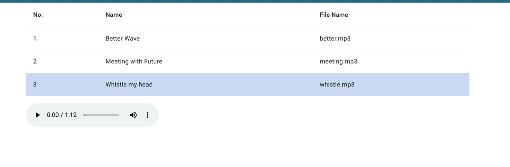

# UnibellTestTask

## Задание
Реализовать проект Angular 2.0, отбражающий единственную страницу, на которой в виде таблицы (mat-table) отражается список звукозаписей.
Строка таблицы, соответствующая звукозаписи, содержит поля - id, Наименование звука, Имя файла звукозаписи.
При клике на строке звукозаписи под таблицей отображается простой проигрыватель, с помощью которого выбранный файл может быть воспроизведен.
Звуки в формате mp3 можно взять с любого публичного сервиса.
Достаточно отобразить 3-4 произвольных звука.
Реализованный проект выложить на GIT и предоставить ссылку.

## Итоговый проект

Основной функционал:
- Запуск проекта после клонирования
`npm i && npm start`
- треки выбираются по клику мыши, повторный клин отменяет выбор
- после выбора клика появляется плеер на котором можно воспроизвести выбранный трек
- при выборе другого трека или отмены выбора текущее проигрывание останавливается
